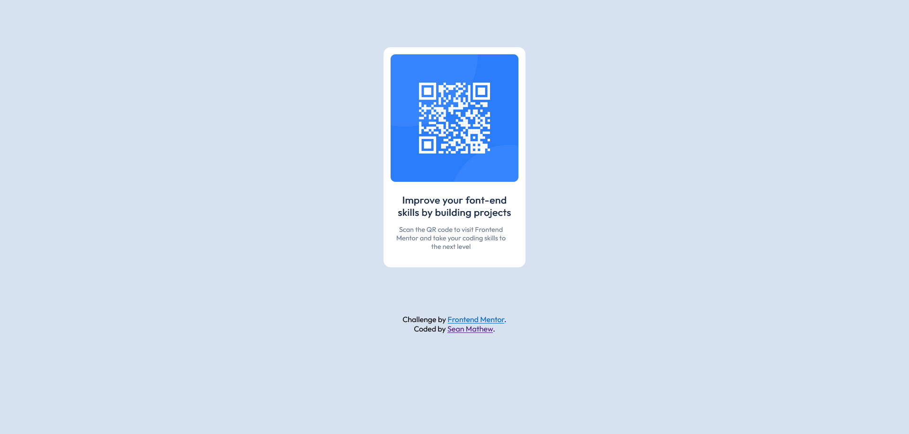

# Frontend Mentor - QR code component solution

This is a solution to the [QR code component challenge on Frontend Mentor](https://www.frontendmentor.io/challenges/qr-code-component-iux_sIO_H). Frontend Mentor challenges help you improve your coding skills by building realistic projects.

## Overview

### Screenshot

### Links

- Solution URL: [Add solution URL here](https://your-solution-url.com)
- Live Site URL: [Add live site URL here](https://your-live-site-url.com)

## My process

My process was pretty simple. I copied over the text content from the starter kit and started coding top to bottom. Pretty simple challenge but wanted to start with something easy to get back into coding.

### Built with

- Semantic HTML5 markup
- CSS custom properties

### What I learned

I just got back into coding about a week ago and I am trying to figure out the "correct way" to code things. I'm still trying to figure out a good set of custom property names that make sense based on the project I'm doing and making sure that I'm not coding things twice. Use the tools I have to make the project as good and efficiently as possible. It's a work in progress though.

### Continued development

The plan is to keep coding as much as I can. I do have a couple of personal projects that I want to do so I think that will help with learning and not getting burned out. My idea is the keep taking on more complex challenges to help learn different code and pushing me to problem solve as I learn more coding languages. I am looking for a template of custom properties that makes sense to me so I can stick to using and getting used to using the same template and just adjusting it based on the project that I'm doing. Any suggustions would be great. I also welcome any critiques on the code to help make it more effecient and easier to write. Like I said I'm just getting back into coding from being out for awhile so I'm a little behind on current standards and coding practices. Thanks for all the help.

## Author

- Frontend Mentor - [@seanmathew01](https://www.frontendmentor.io/profile/seanmathew01)
